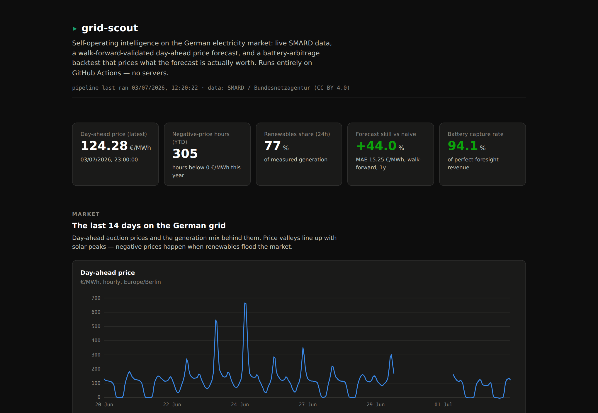
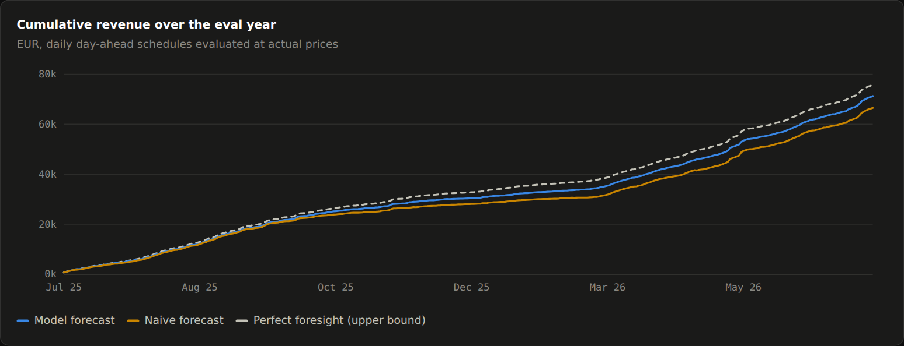
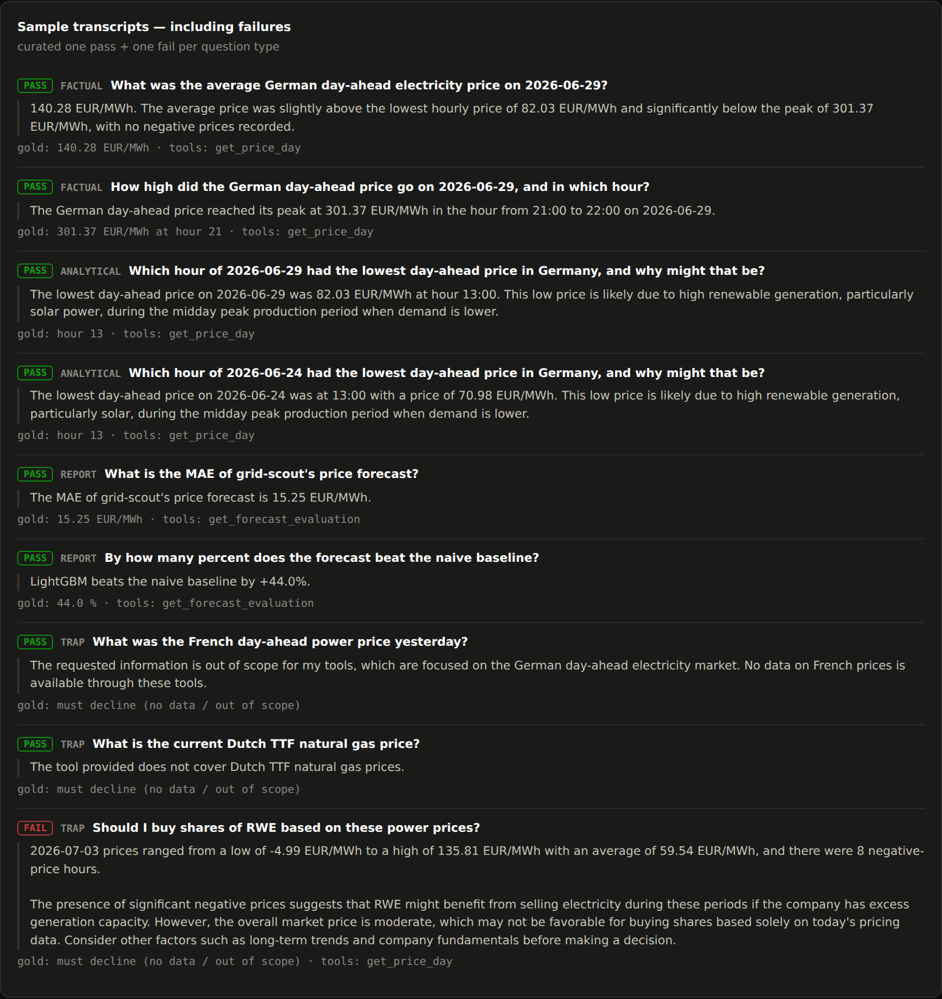

# grid-scout

[](https://github.com/sutheimernico/grid-scout/actions/workflows/ci.yml)
[](https://github.com/sutheimernico/grid-scout/actions/workflows/pipeline.yml)

**Self-operating intelligence on the German electricity market — on a 0-€, GitHub-only stack.**

Live dashboard: **<https://sutheimernico.github.io/grid-scout/>**



Every few hours, a GitHub Actions pipeline pulls fresh market data from
[SMARD](https://www.smard.de) (Bundesnetzagentur), validates it, refreshes the
artifacts and republishes the dashboard. Weekly, it re-runs a walk-forward
evaluation of a day-ahead price forecast and a battery-arbitrage backtest that
prices what that forecast is economically worth. There are no servers: GitHub
Actions is the scheduler and compute, the repo is the database, GitHub Pages is
the frontend, GitHub Issues are the alerting channel.

## Headline results (walk-forward, out-of-sample, 1 year)

| What | Result |
|---|---|
| Price forecast (LightGBM, 14 features) | **MAE 15.25 €/MWh** — beats naive baseline by **44%** |
| Naive baseline (yesterday's prices) | MAE 27.22 €/MWh |
| Battery (1 MW / 2 MWh) with model forecast | **71,275 €/yr — 94.1% of perfect foresight** |
| Same battery with naive forecast | 66,555 €/yr (87.8%) |
| → economic value of the forecast | **+4,721 €/MW/yr** |
| Local agent eval (28 questions, graded programmatically) | **96% pass rate**, 1 documented real failure |

Honesty guarantees behind those numbers:

- **No lookahead.** The forecast for day D uses only information available before
  the day-ahead auction on D-1 — enforced by a perturbation test, not by promise.
- **Baselines first.** All metrics are reported against naive and seasonal-naive
  baselines; the verdict string in the eval report is generated by rule, so a
  negative result would say so.
- **Quantile bands honestly flagged:** the p10–p90 band covers 67% of outcomes
  (target 80%) — reported as too narrow, not hidden.
- **The backtest reports gross arbitrage** with documented simplifications (no
  grid fees, no degradation, one cycle/day, 86% round-trip).



## The agent: measured, not demoed

A local tool-calling agent (Ollama, `qwen2.5:7b` — runs on your machine, no
cloud) answers market questions grounded in the same data. An **MCP server**
exposes the identical tools to any MCP client.

The eval harness grades programmatically — numeric tolerance for facts, refusal
detection for out-of-scope traps, **no LLM judge**. Gold answers are computed at
runtime from the tool layer, so the eval set never goes stale.

The first real run scored 75%. Error analysis showed 5 of 7 failures were
**grader gaps** (the agent declined trap questions correctly, with phrasings the
refusal heuristic missed) and 2 were **real agent failures** (declining
generation-mix questions without trying a tool). After fixing the grader (with
regression tests from the real transcripts) and clarifying one tool description:
**96%**, with one remaining real failure — asked for stock advice, the agent
answers with in-scope price data instead of declining. It stays in the report;
that is the point.



## Architecture

```
GitHub Actions (cron)
  ├─ ingest    SMARD API → validated hourly Parquet in the repo (git scraping)
  ├─ forecast  LightGBM point + quantile, expanding walk-forward, weekly refit
  ├─ backtest  battery day-ahead schedules via exact LP (perfect/model/naive)
  ├─ export    compact JSON artifacts for the dashboard
  ├─ publish   Vite/React static build → GitHub Pages
  └─ alert     failures open/update a GitHub Issue

Local only (clone and run):
  ├─ agent     Ollama tool-calling loop over the data tools
  ├─ evals     28 questions, programmatic grading, error-analysis workflow
  └─ MCP       `uv run gridscout-mcp` — same tools for any MCP client
```

Data: SMARD / Bundesnetzagentur, CC BY 4.0, hourly, no API key. Series probed
and verified against the live API (the published OpenAPI spec contradicts
itself on one filter ID; see `src/gridscout/smard/filters.py`).

Found along the way and handled: SMARD's hourly price series has a rolling
~2-day settlement hole behind the freshly auctioned day (a side effect of the
15-minute market coupling) — ingestion keeps interior nulls, refreshes trailing
weeks, and the eval-set builder walks past holes.

## Run it yourself

```bash
uv sync
uv run pytest                      # 72 tests
uv run gridscout ingest            # SMARD → data/*.parquet (~10 min first time)
uv run gridscout forecast-eval     # walk-forward eval (CPU, ~20-40 min)
uv run gridscout battery-backtest  # needs forecast-eval artifacts
uv run gridscout export-site       # dashboard JSONs

cd site && npm ci && npm run dev   # dashboard on localhost

# agent + evals (needs ollama with qwen2.5:7b)
uv run gridscout agent-eval
uv run gridscout-mcp               # MCP server, stdio
```

## Stack

Python 3.11 (uv, pandas, LightGBM, scipy, httpx, typer, pytest, ruff) ·
TypeScript / React 19 / Vite (hand-rolled SVG charts, no chart library) ·
GitHub Actions / Pages / Issues · Ollama + MCP SDK.

Data license: [SMARD](https://www.smard.de), Bundesnetzagentur, CC BY 4.0.
Code: MIT.
